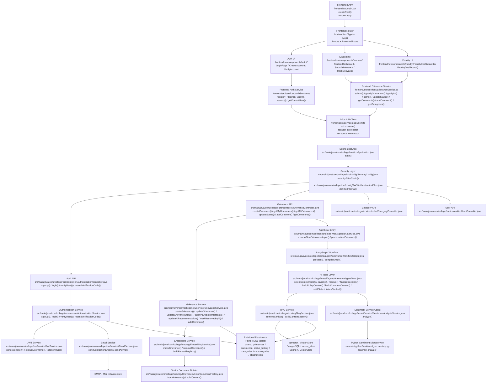
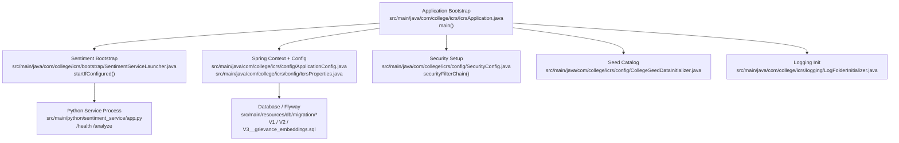
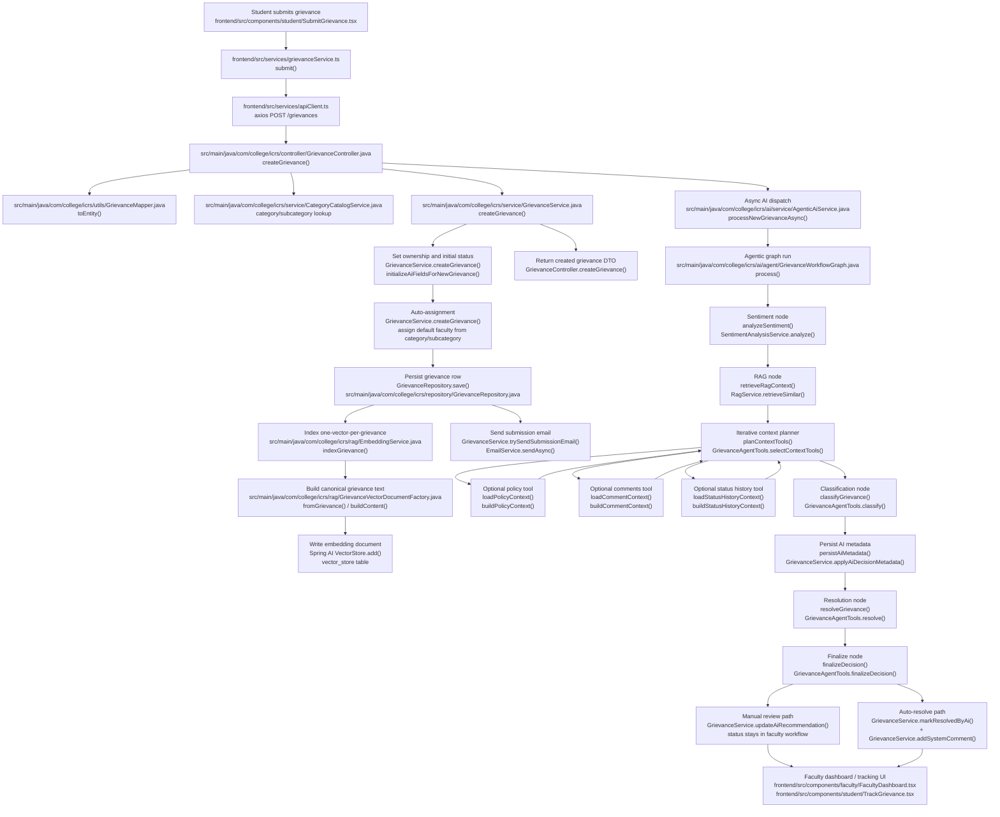
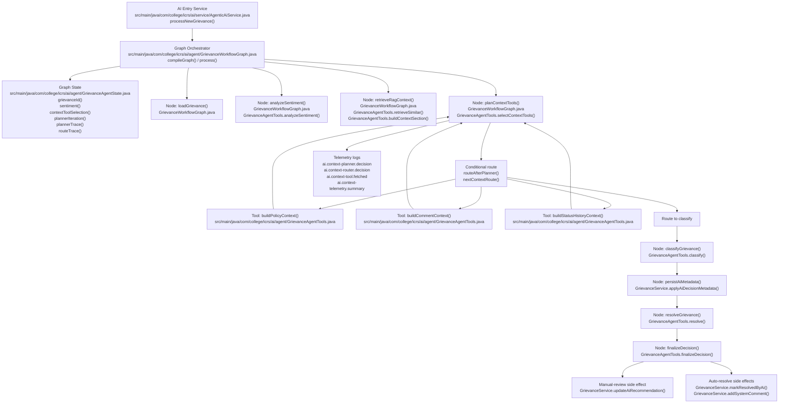
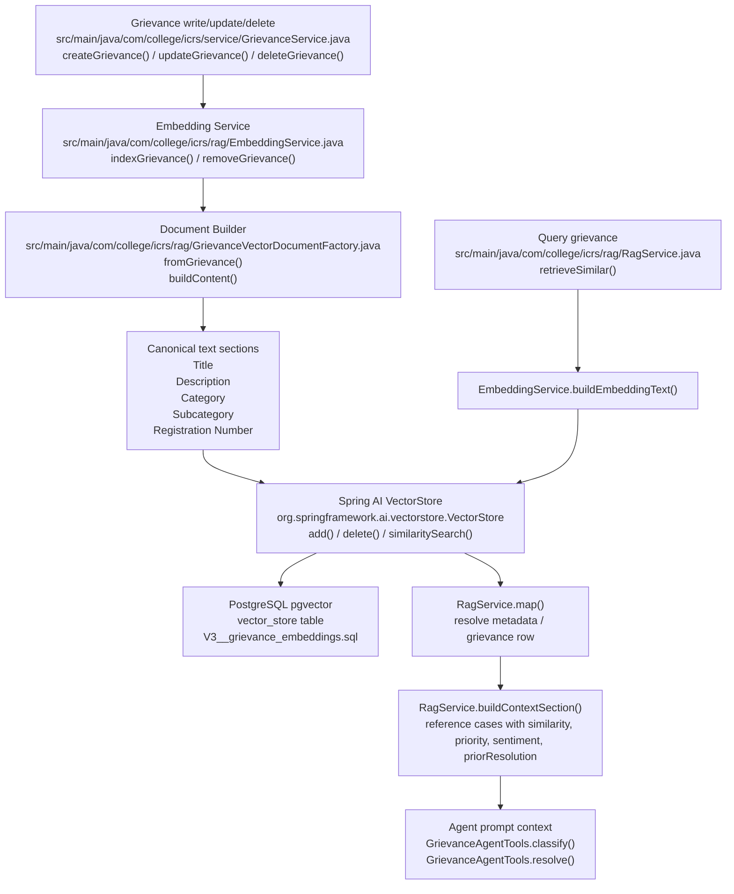
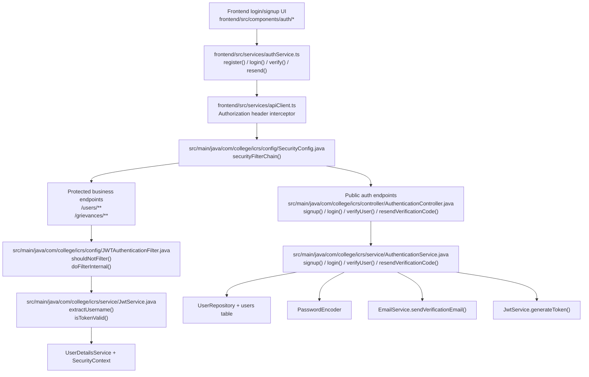
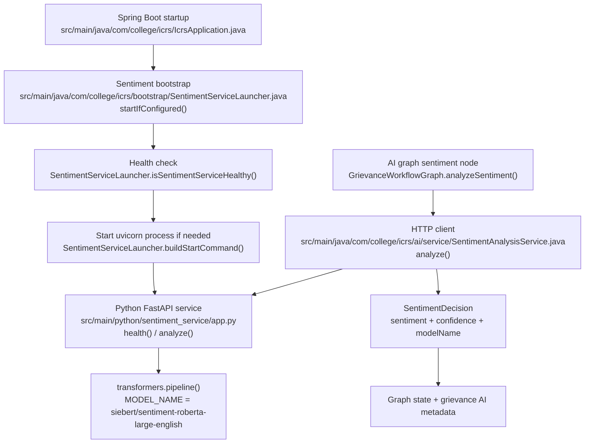

# ICRS Current Architecture And Orchestration

This document describes the current end-to-end architecture of the ICRS project as implemented in the codebase.

It covers:
- frontend application flow
- authentication and security flow
- grievance submission and lifecycle flow
- agentic AI orchestration flow
- RAG and pgvector flow
- sentiment microservice flow
- persistence layer and supporting services

## 1. System Overview

## 2. Startup And Bootstrap Flow

## 3. Student Submission To Final Outcome

## 4. Agentic AI Orchestration Details

## 5. RAG And pgvector Architecture

## 6. Authentication And Security Flow

## 7. Sentiment Service Flow

## 8. Notes About Current Behavior

- The frontend is a Vite + React SPA and talks directly to the Spring Boot backend over HTTP using `axios`.
- Authentication is JWT-based and stateless.
- Each grievance is embedded as exactly one vector document in pgvector.
- The AI workflow is now graph-based and agentic in a bounded sense:
  it uses iterative model-driven tool selection before classification and resolution.
- Planner telemetry is currently logged, not persisted in a database table.
- The sentiment service is a separate Python FastAPI process and can be auto-started by the Java application.
